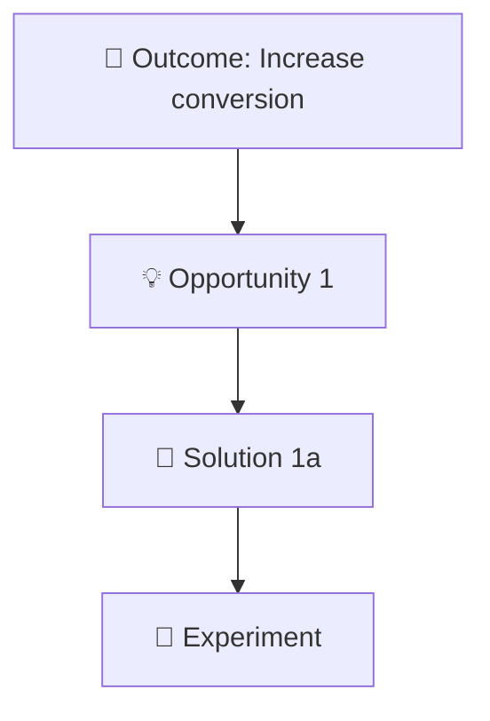

# Opportunity Solution Tree (OST) Skill

Build and refine Opportunity Solution Trees using Teresa Torres' continuous discovery framework.

## What is an Opportunity Solution Tree?

An **Opportunity Solution Tree** is a visual framework that helps product teams connect their work to outcomes through customer opportunities. Created by Teresa Torres, it's a core tool for continuous product discovery.

**Structure:**
```
🎯 Outcome (product/business goal)
  └── 💡 Opportunity (customer need/pain/desire)
      └── 🔧 Solution (product idea to address opportunity)
          └── 🧪 Experiment (test to validate solution)
```

## When to Use This Skill

- **Starting discovery work** on a new initiative or product area
- **Feeling stuck** jumping straight to solutions without understanding customer needs
- **Planning roadmaps** and want to connect features to outcomes
- **Facilitating team workshops** to align on strategy
- **Reviewing existing work** to ensure it's evidence-based

## How to Use

Simply invoke the skill:

```
/ost
```

Or with context:

```
/ost I want to increase user retention
```

```
/ost Here's our current OST: [paste your tree]
```

The skill will:
1. ✅ Assess what you have (outcome, opportunities, research, etc.)
2. ✅ Guide you through missing components
3. ✅ Validate quality (are opportunities really opportunities?)
4. ✅ Generate both markdown and Mermaid diagram outputs
5. ✅ Suggest next steps for using the OST

## What You'll Get

### 1. Markdown Tree Structure
Easy to copy into Notion, Confluence, Google Docs, etc.

```markdown
# Opportunity Solution Tree

## 🎯 Outcome
Increase trial-to-paid conversion from 15% to 25% by Q3

### 💡 Opportunity: Users don't understand value during trial
**Evidence**: Exit surveys show 62% say "wasn't sure it was worth it"

#### 🔧 Solution 1a: Personalized onboarding flow
- **Experiment**: A/B test with 1000 trial users
- **Assumption**: Relevant examples increase perceived value
- **Success metric**: 20%+ increase in feature activation
```

### 2. Mermaid Diagram
Visual diagram that renders in GitHub, Notion, Markdown viewers



## Key Features

### 🎯 Flexible Workflow
- Start from scratch with just an idea
- Expand an existing OST with new opportunities
- Refine and validate current work

### 🔍 Quality Validation
Automatically checks for:
- Solutions disguised as opportunities
- Vague or unmeasurable outcomes
- Missing experiments
- Single-path risk (only one opportunity)

### 🧪 Experiment Design
Helps you design lean experiments:
- What assumption are you testing?
- What's the smallest viable test?
- What metrics indicate success?

### 📚 Research Guidance (Optional)
Need help discovering opportunities? The skill can suggest:
- User interview questions
- Data analysis approaches
- Customer feedback synthesis methods

## Examples

See `examples.md` for:
- ✅ Complete OST examples (SaaS, e-commerce)
- ❌ Common anti-patterns to avoid
- 💡 Tips for great OSTs

## Best Practices

1. **Start with research**: OSTs should be evidence-based, not assumptions
2. **Multiple opportunities**: Explore several paths, not just one
3. **Opportunity test**: "Could we achieve the outcome without solving this?" If yes, it's a real opportunity
4. **Solution diversity**: Different approaches, not variations of the same idea
5. **Experiment first**: Test assumptions before building
6. **Living document**: Update weekly based on learnings

## Common Mistakes (and How This Skill Helps)

| Mistake | How OST Skill Helps |
|---------|---------------------|
| Jumping to solutions too fast | Guides you through opportunity discovery first |
| Opportunities that are really solutions | Validates and helps reframe them |
| Vague outcomes | Ensures outcomes are measurable and time-bound |
| Single opportunity (risky!) | Encourages exploring multiple paths |
| Skipping experiments | Prompts for experiments on every solution |
| Static trees | Treats OST as living document to update |

## Integration with Other Skills

Works great with:
- **/moscow** - Prioritize which opportunities or solutions to pursue first
- **/okr-review** - Validate that your outcome aligns with good OKR practices
- **design-research skills** - Feed research insights into opportunity discovery

## Learn More

- [Teresa Torres' Blog](https://www.producttalk.org)
- [Continuous Discovery Habits](https://www.producttalk.org/2021/05/continuous-discovery-habits/) (book)
- [OST Template](https://www.producttalk.org/opportunity-solution-tree/)

## Feedback & Issues

This skill is designed to help you think like a product leader, not just create a document. If you have suggestions for improvement, create an issue or discussion in the Claude Code repository.

---

**Version**: 1.0
**Author**: Product Team
**Framework**: Teresa Torres' Opportunity Solution Tree
**License**: MIT
