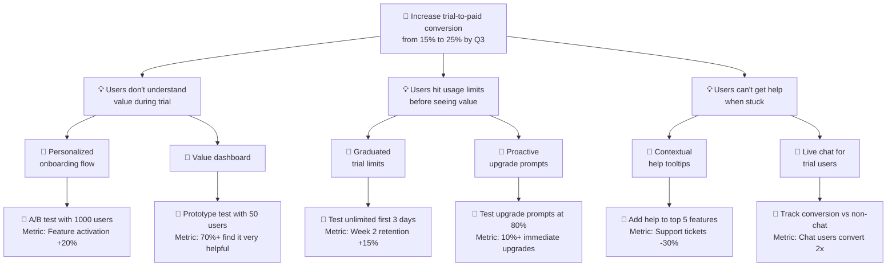

# Opportunity Solution Tree Examples

## Example 1: SaaS Trial Conversion

### 🎯 Outcome
Increase trial-to-paid conversion from 15% to 25% by Q3 2026

### 💡 Opportunity: Users don't understand the value during trial
**Evidence**: Exit surveys show 62% of non-converters say "wasn't sure it was worth it"

#### 🔧 Solution 1a: Personalized onboarding flow
- **Experiment**: Create 3 role-specific onboarding paths, A/B test with 1000 trial users
- **Assumption**: Relevant examples increase perceived value
- **Success metric**: 20%+ increase in feature activation in first 3 days

#### 🔧 Solution 1b: Value dashboard
- **Experiment**: Prototype showing "time saved" and "ROI" metrics, test with 50 users
- **Assumption**: Quantified value makes pricing decision easier
- **Success metric**: 70%+ of test users say it's "very helpful"

### 💡 Opportunity: Users hit usage limits before seeing value
**Evidence**: 45% of churned trials hit the usage limit within first week, 0% converted

#### 🔧 Solution 2a: Graduated trial limits
- **Experiment**: Offer unlimited access for first 3 days, then limits apply
- **Assumption**: Early unlimited access creates stickiness before limits frustrate
- **Success metric**: 15%+ increase in week 2 retention

#### 🔧 Solution 2b: Proactive upgrade prompts
- **Experiment**: When users hit 80% of limit, show ROI calculation and upgrade CTA
- **Assumption**: Contextual prompting converts engaged users
- **Success metric**: 10%+ of prompted users upgrade immediately

### 💡 Opportunity: Users can't get help when stuck
**Evidence**: Support tickets spike on days 2-4 of trial, average response time is 6 hours

#### 🔧 Solution 3a: Contextual help tooltips
- **Experiment**: Add inline help on top 5 most confusing features, track dismissal vs usage
- **Assumption**: Just-in-time help reduces frustration
- **Success metric**: 30%+ reduction in support tickets for those features

#### 🔧 Solution 3b: Live chat for trial users
- **Experiment**: Offer chat to trial users, track conversion rate vs non-chat trials
- **Assumption**: Human support during critical period increases conversion
- **Success metric**: Chat users convert at 2x rate of control

---

## Example 2: E-commerce Checkout Abandonment

### 🎯 Outcome
Reduce cart abandonment rate from 70% to 55% in next 6 months

### 💡 Opportunity: Unexpected shipping costs surprise users at checkout
**Evidence**: Heat maps show 80% of abandonments happen on shipping cost reveal

#### 🔧 Solution 1a: Upfront shipping calculator
- **Experiment**: Add zip code input on product pages, show shipping cost early
- **Assumption**: Early visibility reduces checkout surprises
- **Success metric**: 20%+ reduction in abandonment at shipping step

#### 🔧 Solution 1b: Free shipping threshold
- **Experiment**: Test "$50+ orders ship free" message throughout funnel
- **Assumption**: Clear threshold increases average order value
- **Success metric**: 15%+ increase in AOV, maintains margin

### 💡 Opportunity: Guest checkout friction creates barriers
**Evidence**: 55% of users abandon when asked to create account, user interviews cite "too much effort"

#### 🔧 Solution 2a: True guest checkout
- **Experiment**: Remove account creation requirement, optional account creation post-purchase
- **Assumption**: Reducing friction converts more first-time buyers
- **Success metric**: 25%+ increase in first-time buyer conversion

#### 🔧 Solution 2b: Social login options
- **Experiment**: Add "Continue with Google/Apple" buttons on checkout
- **Assumption**: One-click login feels easier than form filling
- **Success metric**: 40%+ of new users choose social login, conversion increases 10%+

---

## Common Anti-Patterns (What NOT to Do)

### ❌ BAD: Solution Disguised as Opportunity

**Outcome**: Increase user engagement

**"Opportunity"**: Users need a mobile app
- This is a solution, not an opportunity!
- **Better opportunity**: "Users can't access the product when away from their desk"

**"Opportunity"**: Users need better notifications
- This is a solution!
- **Better opportunity**: "Users forget to complete important tasks"

### ❌ BAD: Vague Outcome

**Outcome**: Improve the product
- Not measurable, no timeframe
- **Better**: "Increase NPS from 32 to 45 by end of Q2"

### ❌ BAD: Only One Opportunity

**Outcome**: Increase revenue

**Opportunity**: Users churn because pricing is too high
- Risky to bet everything on one path!
- **Better**: Explore multiple opportunities (pricing, value perception, competition, ease of cancellation, etc.)

### ❌ BAD: Solutions Without Experiments

**Solution**: Redesign the entire dashboard
- No experiment = no validation
- **Better**: "Prototype 3 dashboard concepts, test with 20 users for comprehension and value perception"

### ❌ BAD: Experiments That Aren't Experiments

**"Experiment"**: Build it and see what happens
- Not an experiment, just shipping!
- **Better**: "A/B test new flow with 1000 users, measure completion rate vs control"

---

## Mermaid Diagram Example

---

## Tips for Great OSTs

1. **Root opportunities in evidence**: Every opportunity should cite research (user interviews, data, support tickets, etc.)

2. **Opportunity litmus test**: Ask "Could we achieve the outcome without solving this opportunity?" If yes, it's a real opportunity with independent value

3. **Solution diversity**: For each opportunity, explore different solution types:
   - Quick wins vs. long-term bets
   - Build vs. buy vs. partner
   - Product changes vs. process changes vs. education

4. **Experiment sizing**: Match experiment investment to uncertainty:
   - High uncertainty = small, cheap experiments (prototypes, fake doors, surveys)
   - Low uncertainty = larger tests (A/B tests, beta launches)

5. **Keep it visual**: OSTs are meant to be shared, reviewed, and updated with teams. Make them accessible and clear.

6. **Update regularly**: OSTs are living documents. As you run experiments and learn, prune dead branches and grow new ones.
